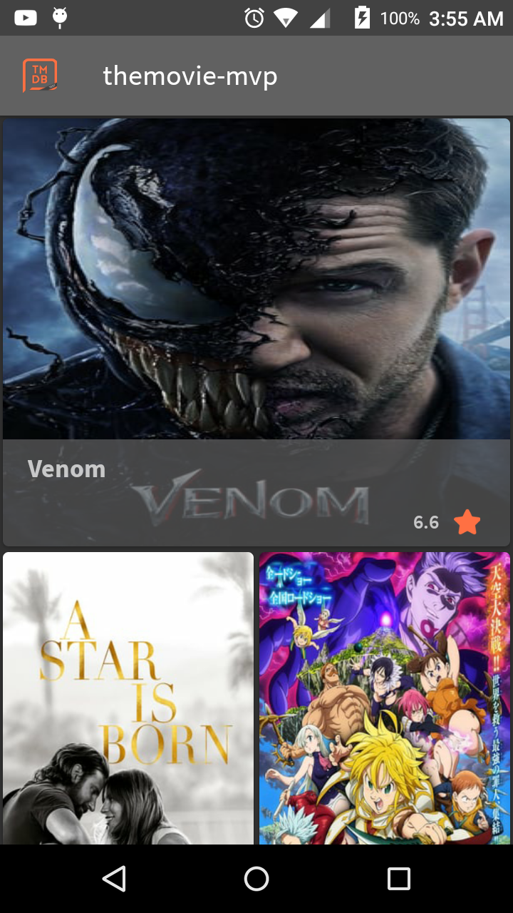
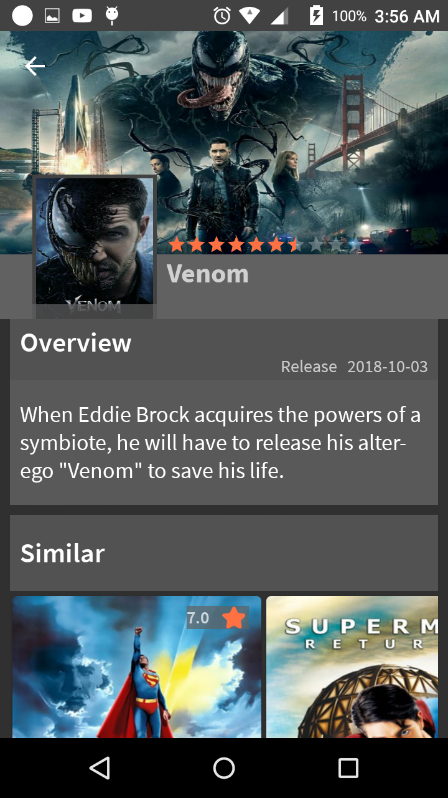

# themovie-mvp
Android project with MVP Java RxJava and DataBinding

# Configuration
Before run project replace the string resource "api_key" with a valid one. This can be generate in <a href="https://www.themoviedb.org/">themovieDB</a>

# Screenshots
  
